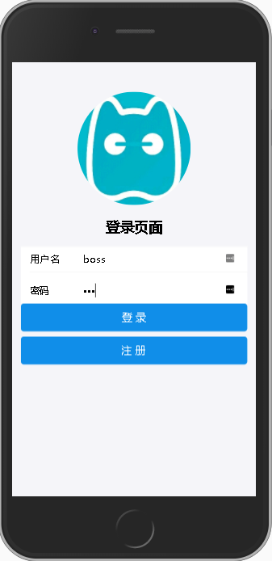
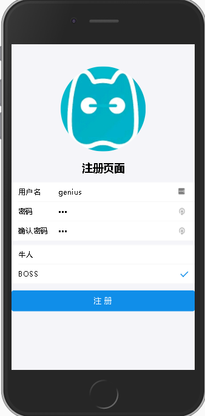
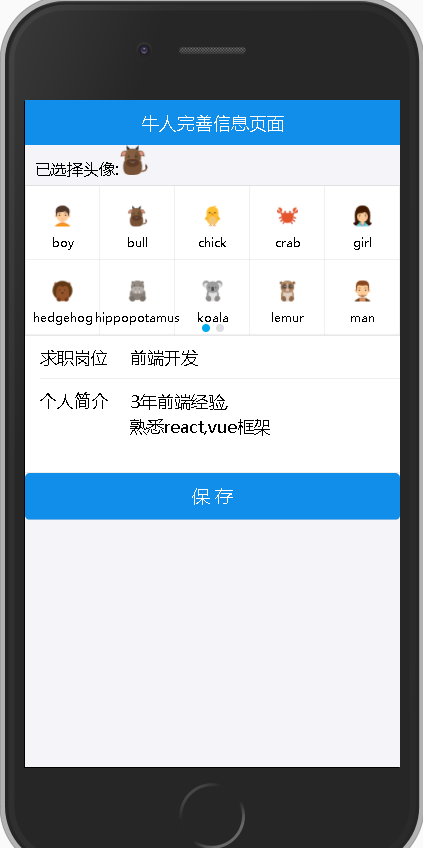
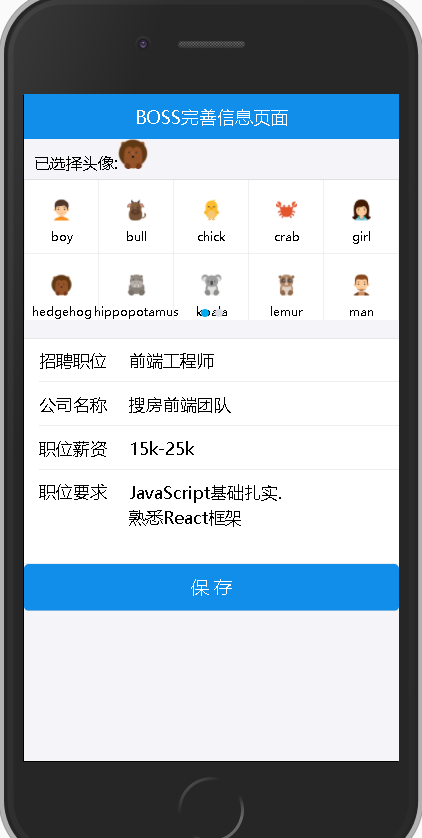
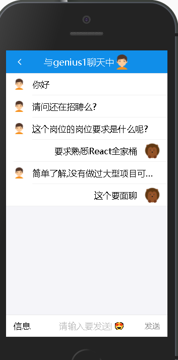
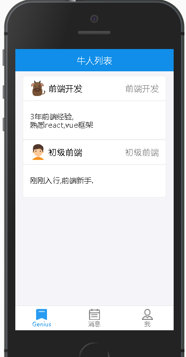

# 直聘APP

## 项目简介
这个项目是参照BOSS直聘开发的一款直聘类APP,分为BOSS和牛人两大角色.  
BOSS可以在APP中发布自己招聘需求,大牛可以在APP中完善自己的个人履历信息.  
BOSS登录后可以查看最新的大牛信息,同样的大牛登录后可以查看最新的BOSS招聘信息.  
双方可以通过该APP直接进行基于Socket.io的实时聊天,支持发送Emoji表情,支持未读提醒功能.  
聊天记录存储在MongoDB中.可以随时查看历史聊天消息.  
数据交互使用json,身份验证基于cookie验证(cookie-parser)

前端技术栈:  
> React+Redux+React-Router+axios+antd-mobile+socket.io-client等  

后端技术栈:   
> nodejs+express+mongoose+nodemon+socket.io+utility等

## 项目截图
登录页 | 注册页 | 牛人完善信息页 | boss完善招聘信息页
---- | ---| ---| ---
 | | | 

boss消息列表页 | 聊天详情页 | 个人中心页 | 牛人列表页
---- | ---| ---| ---
 | | | 

## 运行步骤
* git clone https://github.com/summarychm/boss-react.git
* yarn install
* 新开终端进程,运行 yarn mongoose
* 新开终端进程,运行 yarn node
* 新开终端进程,运行 yarn start

## 使用的技术栈
* [antd-mobile](https://github.com/ant-design/ant-design-mobile/) 引入and design UI库
* [react-app-rewired](https://github.com/timarney/react-app-rewired) 和 [babel-plugin-import](https://github.com/ant-design/babel-plugin-import) Antd-Mobile按需加载
* [react-redux](https://github.com/reactjs/react-redux) 
* [redux-thunk](https://github.com/gaearon/redux-thunk) redux异步中间件
* [babel-plugin-transform-decorators-legacy](https://github.com/loganfsmyth/babel-plugin-transform-decorators-legacy)装饰器插件
* [react-router-dom](https://github.com/ReactTraining/react-router/)
* [axios](https://github.com/axios/axios)
* [nodemon](https://github.com/remy/nodemon) 自动监控node
* [utility](https://github.com/node-modules/utility) 字符串加解密模块
* [prop-types](https://github.com/facebook/prop-types) 组件传递参数验证
* [browser-cookie](https://github.com/voltace/browser-cookies) 操作cookie
* [Socket.io](https://github.com/socketio/socket.io) 
* [Socket.io-client](https://github.com/socketio/socket.io-client)
* 

